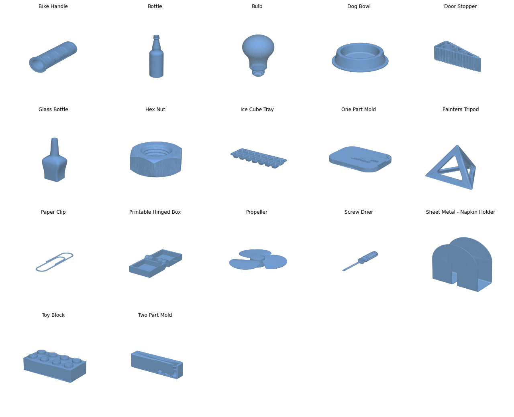

# Basic 3D Designs

A collection of 17 parametric CAD models made in **Autodesk Fusion 360**, each exported as a native Fusion file, a neutral STEP file and a print-ready STL mesh. The set covers everyday objects, mechanisms and manufacturing-oriented parts: moulds, a sheet-metal part and a print-in-place hinge.

## What is in the repo

| Folder | Format | Use |
|---|---|---|
| `Fusion360 File/` | `.f3d` (Fusion 360 archive) | Open in Fusion 360 to edit the parametric timeline |
| `STEP Files/` | `.step` (ISO 10303-21) | Import into other CAD tools (SolidWorks, Inventor, FreeCAD, ...) |
| `STL Files/` | `.stl` (triangle mesh) | Slice and 3D print |

Every model has the same base name in all three folders (for example `Paper Clip.f3d`, `Paper Clip.step`, `Paper Clip.stl`).

## Models

Sizes are bounding-box dimensions measured from the STL files (assumed millimetres).

| Model | Size (mm) | Topic |
|---|---|---|
| Bike Handle | 45 × 125 × 45 | Grip with surface pattern |
| Bottle | 60 × 60 × 240 | Revolved body |
| Glass Bottle | 95 × 78 × 253 | Revolved/lofted body |
| Bulb | 63 × 63 × 112 | Revolved body with threaded base |
| Dog Bowl | 223 × 223 × 58 | Revolved bowl with rim |
| Door Stopper | 126 × 49 × 40 | Ribbed wedge |
| Hex Nut | 23 × 20 × 10 | Threaded fastener |
| Ice Cube Tray | 310 × 114 × 32 | Multi-cavity tray |
| One-Part Mold | 60 × 45 × 6 | Single-body mould |
| Two-Part Mold | 450 × 90 × 161 | Core/cavity mould (largest model) |
| Painters Tripod | 49 × 42 × 39 | Small support stand |
| Paper Clip | 8 × 34 × 0.7 | Swept wire form |
| Printable Hinged Box | 30 × 69 × 14 | Print-in-place hinge |
| Propeller | 154 × 156 × 30 | Three-blade propeller |
| Screw Drier (screwdriver) | 28 × 210 × 28 | Handle and shaft assembly |
| Sheet Metal - Napkin Holder | 125 × 60 × 130 | Sheet-metal design |
| Toy Block | 32 × 16 × 11 | Interlocking brick |

## How to use

1. **Edit a model:** download the `.f3d` file and open it in Fusion 360 (File → Open → Open from my computer).
2. **Use in another CAD tool:** import the matching `.step` file.
3. **Print a model:** load the `.stl` into your slicer (PrusaSlicer, Cura, Bambu Studio). Check scale and orientation first; the hinged box is designed to print as one piece, so use a fine layer height.

## Known issues

- Four STL files are not watertight and need repair before slicing: `One-Part Mold` (the hyphenated variant), `Propeller`, `Screw Drier` and `Two Part Mold`. Re-export from Fusion 360 or repair with Meshmixer / PrusaSlicer's repair tool.
- `STL Files/` contains two files for the one-part mould (`One Part Mold.stl` and `One-Part Mold.stl`); keep the watertight `One Part Mold.stl`.
- No print results or tolerances are recorded yet; dimensions above come from the CAD exports, not from printed parts.

## Credits

<!-- TODO: add the source of any tutorial or reference each design follows, with links, or state that the design is original. -->
Models created by [AwesomeYash](https://github.com/AwesomeYash) in Fusion 360.

## License

MIT License (see `LICENSE`).
